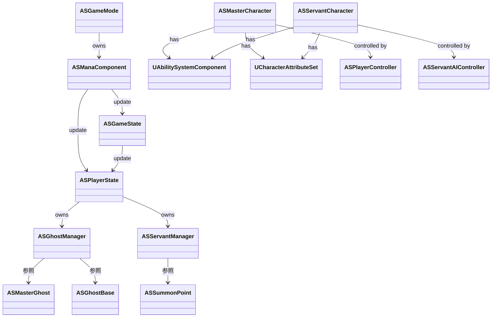

ギルティギア2風ゲーム プログラム設計

- [ネットワーク機能(※TODO、まずは対応しない)](#ネットワーク機能todoまずは対応しない)
- [チーム管理](#チーム管理)
- [共通](#共通)
- [クラス一覧](#クラス一覧)
  - [ゲームの状態管理](#ゲームの状態管理)
  - [アクター](#アクター)
  - [アビリティ](#アビリティ)
  - [UI](#ui)
  - [各列挙体、構造体、ゲームプレイタグ等のデータ定義](#各列挙体構造体ゲームプレイタグ等のデータ定義)
- [クラスの関係](#クラスの関係)
- [システム基盤](#システム基盤)
  - [アクションシステム](#アクションシステム)
  - [コンポーネント構成](#コンポーネント構成)
  - [エフェクトシステム](#エフェクトシステム)
- [タイトルからゲーム開始までの流れ](#タイトルからゲーム開始までの流れ)
- [ゲーム開始からの流れ](#ゲーム開始からの流れ)
  - [ゲーム画面遷移時(GameModeのInitGame())](#ゲーム画面遷移時gamemodeのinitgame)
  - [ゲーム開始状態(GameModeのStartGame() MatchStateのStartMatch)](#ゲーム開始状態gamemodeのstartgame-matchstateのstartmatch)
  - [プレイヤー入場(GameModeのPlayerEntrance() MatchStateのPlayerEntrance())](#プレイヤー入場gamemodeのplayerentrance-matchstateのplayerentrance)
  - [ゲーム開始前処理(GameModeのPreStartMatch() MatchStateのPreStartMatch())](#ゲーム開始前処理gamemodeのprestartmatch-matchstateのprestartmatch)
  - [ゲーム開始カットシーン(GameModeのMatchGong() MatchModeのMatchGong)](#ゲーム開始カットシーンgamemodeのmatchgong-matchmodeのmatchgong)
  - [ゲーム開始(GameModeのProgressへの変更処理)](#ゲーム開始gamemodeのprogressへの変更処理)
  - [ゲーム進行中(GameModeのProgress)](#ゲーム進行中gamemodeのprogress)
  - [ゲーム終了(GameModeのEndMatch() MatchStateのEndMatch())](#ゲーム終了gamemodeのendmatch-matchstateのendmatch)
  - [ゲーム結果表示(GameModeのShowResult() MatchStateのShowResult())](#ゲーム結果表示gamemodeのshowresult-matchstateのshowresult)
- [サーヴァント召喚時の流れ](#サーヴァント召喚時の流れ)
- [ゲームモード設定](#ゲームモード設定)
  - [GameMode](#gamemode)
  - [EGamePhase](#egamephase)
  - [ETeam](#eteam)
  - [FVictoryCondition](#fvictorycondition)
  - [EVictoryType](#evictorytype)
  - [GameState](#gamestate)
  - [FTeamManaGenerationRate](#fteammanagenerationrate)
  - [PlayerState](#playerstate)
  - [PlayerStateデリゲート](#playerstateデリゲート)
- [プレイヤー制御システム](#プレイヤー制御システム)
  - [PlayerController](#playercontroller)
  - [AIController](#aicontroller)
- [キャラクターシステム](#キャラクターシステム)
  - [プレイヤー（マスター）設計](#プレイヤーマスター設計)
    - [クラス](#クラス)
    - [基本](#基本)
    - [入力](#入力)
    - [属性（Attributes）](#属性attributes)
  - [基本アクション](#基本アクション)
    - [移動系](#移動系)
    - [戦闘系](#戦闘系)
    - [アクション](#アクション)
  - [サーヴァント](#サーヴァント)
  - [サーヴァントのAIコントローラー](#サーヴァントのaiコントローラー)
- [ゴースト](#ゴースト)
  - [ゴースト設計](#ゴースト設計)
    - [クラス](#クラス-1)
    - [基本](#基本-1)
    - [ゴーストの情報取得関数](#ゴーストの情報取得関数)
  - [マスターゴースト設計](#マスターゴースト設計)
    - [クラス](#クラス-2)
    - [基本](#基本-2)
  - [通常ゴースト](#通常ゴースト)
    - [基本](#基本-3)
- [リソース管理システム](#リソース管理システム)
  - [GhostManager](#ghostmanager)
  - [ServantManager](#servantmanager)
  - [SummonPoint](#summonpoint)
- [UI/HUDシステム](#uihudシステム)
  - [GameHUD](#gamehud)
- [拡張性への対応](#拡張性への対応)
  - [プレイヤー数拡張](#プレイヤー数拡張)
  - [AI難易度](#ai難易度)
  - [コンテンツ拡張](#コンテンツ拡張)
- [7. 開発フェーズ](#7-開発フェーズ)
  - [Phase 1: 基本システム](#phase-1-基本システム)
  - [Phase 2: 戦闘システム](#phase-2-戦闘システム)
  - [Phase 3: ゲームシステム](#phase-3-ゲームシステム)
  - [Phase 4: AI実装](#phase-4-ai実装)
  - [Phase 5: ゲームフロー](#phase-5-ゲームフロー)
- [アクションシステム](#アクションシステム-1)
  - [基本アクション](#基本アクション-1)
  - [カメラ制御](#カメラ制御)
  - [UI連携](#ui連携)
    - [オルガン画面](#オルガン画面)
      - [オルガン画面の動作詳細](#オルガン画面の動作詳細)
- [ネットワーク機能(※TODO、まずは対応しない)](#ネットワーク機能todoまずは対応しない-1)
- [チーム管理](#チーム管理-1)
  - [キャラクター機能システム](#キャラクター機能システム)
  - [ASCharacterBaseComponent](#ascharacterbasecomponent)
  - [ASCharacterActionComponent](#ascharacteractioncomponent)
  - [ASCharacterCombatComponent](#ascharactercombatcomponent)
  - [ASCharacterStateComponent](#ascharacterstatecomponent)
- [データ構造](#データ構造)
  - [FServantGroup](#fservantgroup)
- [チーム別攻撃チャンネル](#チーム別攻撃チャンネル)
  - [チーム別攻撃チャンネル](#チーム別攻撃チャンネル-1)
  - [コリジョンタグ管理](#コリジョンタグ管理)
    - [タグの定義](#タグの定義)
    - [主要機能](#主要機能)

# ネットワーク機能(※TODO、まずは対応しない)
- コンポーネントの状態同期
- アクション実行の権限管理
- 属性値の同期

# チーム管理
  - [キャラクター機能システム](#キャラクター機能システム)
  - [ASCharacterBaseComponent](#ascharacterbasecomponent)
  - [ASCharacterActionComponent](#ascharacteractioncomponent)
  - [ASCharacterCombatComponent](#ascharactercombatcomponent)
  - [ASCharacterStateComponent](#ascharacterstatecomponent)


# 共通
- 共通定義以外への依存をなくす
- できるだけ名前(文字列)でのアクセスを行う
- プロジェクト固有のプレフィックスは"AS"

# クラス一覧
## ゲームの状態管理
- `ASGameMode`: ゲームルールと勝利条件の管理。
- `ASGameState`: ゲーム全体の状態管理（フェーズ、時間）
- `ASPlayerState`: プレイヤーの状態管理（マナ、チーム、プレイヤーのサーヴァント、召喚、サーヴァントの数、サーヴァントのグループの管理）
- `ASManaComponent`: 定期的にPlayerStateで管理しているマナを追加する。
- `ASSummonPoint`: 召喚場所。ASPlayerStateで管理する。indexを持ち、召喚順序として使用する。BeginPlayでPlayerStateに登録。
- `ASGhostManager`: ゴースト管理

## アクター
- `ASPlayerController`: プレイヤー入力とカメラの制御
- `ASMasterCharacter`: プレイヤーキャラクターのベースクラス
- `ASServantCharacter`: サーヴァントのベースクラス
- `ASGhostBase`: ゴーストのベースクラス。隣のゴーストへの参照と距離を持つ（複数のゴーストを参照）
- `ASNormalGhost`: 通常ゴーストクラス。隣のゴーストへの参照と距離を持つ（複数のゴーストを参照）
- `ASMasterGhost`: マスターゴーストクラス。隣のゴーストへの参照と距離を持つ（複数のゴーストを参照）
- `ASServantAIController`: AIコントローラー
- `ASBehaviorTree`: AI行動ツリー
- `ASBlackboardData`: AIブラックボード

## アビリティ
- `ASJumpAbility`: ジャンプアビリティ。単発・二段ジャンプの制御と空中制御を管理
- `ASDashAbility`: ダッシュアビリティ。指定方向への高速移動と壁衝突時の処理を制御
- `ASMoveAbility`: 移動アビリティ。キャラクターの基本移動を制御
- `ASAttackAbility`: 通常攻撃アビリティ。コンボシステムと攻撃判定を管理
- `ASSpecialAbility`: 必殺技アビリティ。キャラクター固有の特殊技を制御
- `ASItemAbility`: アイテム使用アビリティ。アイテムの効果を発動
- `ASCameraControlAbility`: カメラ操作アビリティ。視点の移動と回転を制御
- `ASLockOnAbility`: ロックオンアビリティ。ターゲットの追跡と視点固定を管理
- `ASCameraResetAbility`: カメラリセットアビリティ。視点を初期位置に戻す
- `ASOrganAbility`: オルガン画面アビリティ。画面の開閉とユニット指示を制御

## UI
- `ASHUDBase`: メインHUD
- `ASOrganWidget`: オルガン画面。サーヴァントの召喚、サーヴァントへの指示を行う。
- `ASResourceWidget`: リソース表示
- `ASServantInfoWidget`: サーヴァント情報表示。ASPlayerStateから情報を取得して表示する。
- `ASPauseMenuWidget`: ポーズメニュー

## 各列挙体、構造体、ゲームプレイタグ等のデータ定義
- `ASGameplayTags`: ゲームプレイタグ
- `ASTypes`: 列挙型と構造体

# クラスの関係


# システム基盤

## アクションシステム
- コンポーネントベースのアクション管理システムを採用
- 主な用途
  - キャラクターステータスの管理
  - アクション（プレイヤー、サーヴァントの移動、ジャンプ、攻撃等の各動作）の実装
  - バフ/デバフの管理
  - リソース（マナ）の管理
  - ダメージ計算システム
  - コリジョンチャンネルでの攻撃ヒット有無の管理

## コンポーネント構成
- ASCharacterBaseComponent
  - 基本属性の管理
  - チーム制御
  - 状態管理

- ASCharacterActionComponent
  - 移動制御
  - ジャンプ（単発・二段）
  - ダッシュ
  - 攻撃
  - 特殊行動

- ASCharacterCombatComponent
  - 攻撃判定
  - ダメージ計算
  - コンボシステム
  - ヒット処理

- ASCharacterStateComponent
  - 状態管理
  - エフェクト制御
  - アニメーション制御

## エフェクトシステム
- 永続的エフェクト
  - 基本ステータス変更
  - 継続的な効果

- 一時的エフェクト
  - バフ/デバフ
  - 状態異常

- 即時エフェクト
  - ダメージ
  - 回復
  - 消費処理

# タイトルからゲーム開始までの流れ

1. タイトル画面でゲーム選択
2. ゲーム選択画面でプレイヤー選択(プレイヤーキャラクターID)、チーム選択
3. 選択情報をGameInstanceに保存
4. ゲーム開始
5. プレイヤー選択、チーム選択情報をGameModeがGameInstanceから取得
6. ゲーム開始

# ゲーム開始からの流れ
## ゲーム画面遷移時(GameModeのInitGame())

## ゲーム開始状態(GameModeのStartGame() MatchStateのStartMatch)
- GameModeがGameInstanceからプレイヤー選択、チーム選択情報を取得
- GameModeがプレイヤーに初期位置を割り当て。
  - 各プレイヤー番号をプレイヤーに割り当てることで、対応するマスターゴースト、召喚ポイント、プレイヤーの開始位置が分かるようにする。
    - PlayerStateにプレイヤー番号を割り当てる。 = チームの割り当て
- PlayerStateへのチーム設定
- サーヴァントマネージャーの召喚キューのクリア
- プレイヤーの開始位置の探索(FindPlayerStart)
  - プレイヤー番号の名前でPlayer Start Tagを探す。(Player0, Player1, Player2, Player3)
  - プレイヤーキャラクターのスポーン(RestartPlayer)
- スポーンポイントのPlayerState(サーヴァントマネージャー)への登録
  - スポーンポイントをプレイヤー番号で探し、サーヴァントマネージャーへの登録を行う
    - PlayerStateが自分のプレイヤー番号と同じ召喚ポイントを探し当てる。
- PlayerStateが自分のプレイヤー番号でマスターゴーストを探し、マスターゴーストのチームを自分のチームに設定する。

## プレイヤー入場(GameModeのPlayerEntrance() MatchStateのPlayerEntrance())
- UI操作からゲーム画面操作への移行
  - プレイヤー操作は抑制
- プレイヤー表示のカットイン

## ゲーム開始前処理(GameModeのPreStartMatch() MatchStateのPreStartMatch())
- ゴーストの占領チームによる占領度の初期化
- サーヴァントを最も近い、自チームの占領しているゴーストに移動

## ゲーム開始カットシーン(GameModeのMatchGong() MatchModeのMatchGong)
- ゲーム開始カットシーンの再生(プレイヤー順で再生させる)
- カットシーン終わりでInProgressに移行

## ゲーム開始(GameModeのProgressへの変更処理)
- マナの生成開始
- プレイヤー操作入力を可能にする

## ゲーム進行中(GameModeのProgress)
- マナの生成
- マスターゴーストのダメージをGameStateに通知
  - GameState内のチームごとのマスターゴーストのHPを更新
  - GameStateからPlayerStateのマスターゴーストのHPを更新

## ゲーム終了(GameModeのEndMatch() MatchStateのEndMatch())
- マナの生成終了
- 即時ShowResultに移行

## ゲーム結果表示(GameModeのShowResult() MatchStateのShowResult())
- ゲーム結果の表示


# サーヴァント召喚時の流れ
1. オルガン画面から召喚サーヴァント指定(経路、グループ指定)
2. サーヴァントマネージャーの召喚キューに登録
3. 時間経過を監視
4. 召喚可能になったら、キューから召喚ポイントにサーヴァント召喚を指示(経路、グループ指定)

# ゲームモード設定

## GameMode
```markdown
ASGameMode : AGameMode
- Properties
  - MaxPlayers: int32 (default: 2)
  - CurrentPhase: EGamePhase
  - TimeLimit: float
  - ManaManager: ASManaComponent*
  - AIServantManager: ASServantAIController*
  - VictoryConditions: TArray<FVictoryCondition>
  - WinningTeam: int32

- Functions
  // 基本ゲームフロー
  - InitGame()
  - PreStartMatch()
  - StartMatch()
  - EndMatch()
  
  // 勝敗管理
  - CheckVictoryConditions()
  - HandleMasterDeath(ASMasterCharacter* DeadMaster)
  - HandleMasterGhostDestroyed(ASMasterGhost* DestroyedGhost)
  - HandleTimeLimit()
  - DetermineWinner()
  - BroadcastMatchResult()

  // プレイヤー管理
  - HandlePlayerJoined()
  - SetupPlayerTeam(APlayerState* NewPlayer)
  - InitializeAIPlayer()
```

## EGamePhase
```markdown
enum class EGamePhase
{
    PreMatch,        // マッチ開始前の準備
    Starting,        // 開始演出
    InProgress,      // ゲーム進行中
    TimeUp,          // 制限時間終了
    PostMatch,       // 結果判定
    GameOver         // 決着
}
```

## ETeam
```markdown
enum class ETeam
{
    None,
    TeamA,
    TeamB,
    TeamC,
    TeamD
}
```

## FVictoryCondition
```markdown
struct FVictoryCondition
{
    EVictoryType Type
    bool bIsSatisfied
    ETeam TeamID
    float TimeStamp
}
```

## EVictoryType
```markdown
enum class EVictoryType
{
    MasterKilled,          // マスター撃破
    MasterGhostDestroyed,  // 本拠地破壊
    TimeUpGhostDomination, // 制限時間終了時のゴースト支配数
    TeamWipe               // チーム全滅
}
```

## GameState
ゲーム全体の状態管理（フェーズ、時間）
全体に共有するものをGameStateで管理する。
各Playerに共有するもの(マナ等)はGameStateからPlayerStateに渡す。

```markdown
ASGameState : AGameState
- Properties
  - CurrentPhase: EGamePhase (ReplicatedUsing = OnRep_CurrentPhase)
  - RemainingTime: float (Replicated)
  - MatchElapsedTime: float (Replicated)
  - GhostManager: UASGhostManager*
  - FriendlyMasterGhostHealth: float (Replicated)
  - EnemyMasterGhostHealth: float (Replicated)
  - MaxMasterGhostHealth: float (Replicated)
  - TeamManaGenerationRates: TArray<FTeamManaGenerationRate> (Replicated)
  - OnUpdateHUD: FUpdateHUDDelegate

- Functions
  - SetCurrentPhase(EGamePhase NewPhase)
  - GetCurrentPhase(): EGamePhase
  - SetRemainingTime(float NewTime)
  - GetRemainingTime(): float
  - GetMatchElapsedTime(): float
  - GetGhostManager(): UASGhostManager*
  - UpdateMatchTime(float DeltaTime)
  - OnRep_CurrentPhase()
  - OnRep_RemainingTime()
  - UpdateHUDForPhase(EGamePhase Phase)
  - SetupPreMatch()
  - PrepareStartingPhase()
  - StartGameplay()
  - HandleTimeUp()
  - HandlePostMatch()
  - HandleGameOver()
  - CalculateFinalScores()
  - SaveMatchStatistics()
  - GetFriendlyMasterGhostHealth(): float
  - GetEnemyMasterGhostHealth(): float
  - GetMaxMasterGhostHealth(): float
  - SetFriendlyMasterGhostHealth(float NewHealth)
  - SetEnemyMasterGhostHealth(float NewHealth)
```

## FTeamManaGenerationRate
```markdown
/** チームごとのマナ生成量を管理する構造体 */
USTRUCT()
struct FTeamManaGenerationRate
{
    GENERATED_BODY()

    UPROPERTY()
    ETeam Team;

    UPROPERTY()
    float Rate;

    FTeamManaGenerationRate() : Team(ETeam::None), Rate(0.0f) {}
    FTeamManaGenerationRate(ETeam InTeam, float InRate) : Team(InTeam), Rate(InRate) {}
};
```

## PlayerState
プレイヤーごとに管理するものをPlayerStateで管理する。

```markdown
ASPlayerState : APlayerState
- Components
  - ServantManager: UASServantManager*

- Properties
  - Team: ETeam (ReplicatedUsing = OnRep_Team)
  - PlayerNumber: int32 (Replicated)
  - PlayerCharacterID: int32 (Replicated)
  - PlayerType: EPlayerType (Replicated)
  - CurrentMana: float (Replicated)
  - ManaIncreaseRate: float (Replicated)
  - InitialMana: float
  - PlayerHealth: float (Replicated)
  - PlayerMaxHealth: float (Replicated)
  - MaxMana: float
  - ManaGenerationInterval: float
  - OwnedMasterGhost: AASMasterGhost*
  - SummonPoints: TArray<AASSummonPoint*>
  - OnManaAmountChanged: FOnManaAmountChangedDelegate
  - OnTeamChanged: FOnTeamChangedDelegate

- Functions
  - GetTeam(): ETeam
  - SetTeam(ETeam NewTeam)
  - GetPlayerNumber(): int32
  - SetPlayerNumber(int32 NewPlayerNumber)
  - SetPlayerIndex(int32 NewPlayerIndex)
  - GetPlayerCharacterID(): int32
  - SetPlayerCharacterID(int32 NewCharacterID)
  - GetPlayerType(): EPlayerType
  - SetPlayerType(EPlayerType NewType)
  - AddMana(float Amount)
  - ConsumeMana(float Amount): bool
  - GetCurrentMana(): float
  - SetCurrentMana(float NewMana)
  - HasEnoughMana(float Amount): bool
  - GetManaIncreaseRate(): float
  - SetManaIncreaseRate(float NewRate)
  - GetServantManager(): UASServantManager*
  - GetMasterGhost(): AASMasterGhost*
  - RegisterMasterGhost(AASMasterGhost* MasterGhost)
  - RegisterSummonPoint(AASSummonPoint* SummonPoint)
  - GetSummonPoints(): TArray<AASSummonPoint*>
  - PrepareForMatch()
  - InitializeResources()
  - InitializeServantManager()
  - CalculateFinalScore()
  - GetPlayerHealth(): float
  - GetPlayerMaxHealth(): float
  - SetPlayerHealth(float NewHealth)
  - GetMaxMana(): float
  - HandleManaGeneration()
  - ResetManaGenerationTimer()
  - OnManaChanged()
  - OnRep_CurrentMana()
  - OnRep_Team()
```

## PlayerStateデリゲート
```markdown
/** マナ量が変更された時のデリゲート */
DECLARE_DYNAMIC_MULTICAST_DELEGATE_OneParam(FOnManaAmountChangedDelegate, float, NewAmount);

/** チーム変更時のデリゲート */
DECLARE_DYNAMIC_MULTICAST_DELEGATE_OneParam(FOnTeamChangedDelegate, ETeam, NewTeam);
```

# プレイヤー制御システム

## PlayerController
```markdown
ASPlayerController : APlayerController
- Properties
  - ControlledMaster: ASMasterCharacter*
  - SelectedServants: TArray<ASServantCharacter*>
  - CurrentCommand: ECommandType

- Functions
  - SetupInputBindings()
  - HandleMoveInput(const FInputActionValue& Value)
  - HandleJumpInput()
  - HandleAttackInput()
  - HandleDashInput()
  // 他の入力ハンドラー
```

## AIController
```markdown
ASServantAIController : AAIController
- Properties
  - BehaviorTree: UBehaviorTree*
  - BlackboardComponent: UBlackboardComponent*
  - DifficultyLevel: EAIDifficulty

- Functions
  - InitializeAI()
  - UpdateBehavior()
  - EvaluateStrategy()
```

# キャラクターシステム

## プレイヤー（マスター）設計
### クラス
ASMasterCharacter : ACharacter

### 基本
- 以下のコンポーネントを持つ
  - スケルタルメッシュ
  - Collision
  - カメラ
  - ASCharacterActionComponent
  - ASCharacterStateComponent
  - ASCharacterCombatComponent
- チームによりヒット判定が変わるため、チームごとのコリジョンのチャンネルの設定を行う。
  - 自チームの攻撃のHit判定が発生しないよう、自チームのチャンネルは無視するようにCollisionに設定を行う。
- ダメージは`ASCharacterCombatComponent`で処理
- プレイヤーはダメージを受けたという通知からアクションを起こす。
- ゲームモードから勝利、敗北のポーズを行えるように、アクションを呼び出す関数を持つ
- ダッシュは継続して走り続け、壁などの障害物にぶつかった際にダメージのモーションを行う。

### 入力
- 入力はEnhanced Input Systemを使用し、ハイブリッドアプローチを採用する
  - 基本的な入力マッピングは`DefaultInput.ini`とアセットで定義
  - C++での拡張機能とカスタマイズを実装

- 入力設定の管理
  ```cpp
  // 入力設定データアセット
  UCLASS()
  class ACTIONSTRATEGYALLAI_API UASInputConfig : public UDataAsset
  {
      GENERATED_BODY()
  public:
      // 基本アクション
      UPROPERTY(EditDefaultsOnly, BlueprintReadOnly)
      UInputAction* MoveAction;

      UPROPERTY(EditDefaultsOnly, BlueprintReadOnly)
      UInputAction* LookAction;

      UPROPERTY(EditDefaultsOnly, BlueprintReadOnly)
      UInputAction* JumpAction;

      UPROPERTY(EditDefaultsOnly, BlueprintReadOnly)
      UInputAction* AttackAction;

      UPROPERTY(EditDefaultsOnly, BlueprintReadOnly)
      UInputAction* DashAction;

      // 特殊アクション
      UPROPERTY(EditDefaultsOnly, BlueprintReadOnly)
      UInputAction* SpecialAction;

      UPROPERTY(EditDefaultsOnly, BlueprintReadOnly)
      UInputAction* UseItemAction;

      UPROPERTY(EditDefaultsOnly, BlueprintReadOnly)
      UInputAction* ToggleOrganAction;

      UPROPERTY(EditDefaultsOnly, BlueprintReadOnly)
      UInputAction* LockOnAction;

      UPROPERTY(EditDefaultsOnly, BlueprintReadOnly)
      UInputAction* ResetCameraAction;

      // 入力マッピングコンテキスト
      UPROPERTY(EditDefaultsOnly, BlueprintReadOnly)
      UInputMappingContext* DefaultMappingContext;
  };

  // 入力管理クラス
  UCLASS()
  class ACTIONSTRATEGYALLAI_API UASInputManager : public UObject
  {
      GENERATED_BODY()
  public:
      // 初期化
      void Initialize(APlayerController* PlayerController);
      
      // デフォルト設定の適用
      void ApplyDefaultMappings();
      
      // カスタム設定の保存/読み込み
      void SaveCustomMappings();
      void LoadCustomMappings();
      
      // キーマッピングの動的変更
      void UpdateKeyMapping(FName ActionName, FKey NewKey);

  private:
      UPROPERTY()
      UASInputConfig* InputConfig;

      UPROPERTY()
      UEnhancedInputLocalPlayerSubsystem* InputSubsystem;

      UPROPERTY()
      TMap<FName, FKey> CustomKeyMappings;
  };
  ```

- 入力のマッピング（デフォルト設定）
  - Move: WASD / 左スティック
  - Look: マウス移動 / 右スティック
  - Jump: スペース / A（Xbox）/ X（PS）
  - Attack: 左クリック / X（Xbox）/ □（PS）
  - PowerAttack: 右クリック / Y（Xbox）/ △（PS）
  - Dash: 左Shift / RB（Xbox）/ R1（PS）
  - UseItem: E / B（Xbox）/ ○（PS）
  - ToggleOrgan: Tab / Select（Xbox）/ Share（PS）
  - LockOn: 中クリック / LB（Xbox）/ L1（PS）
  - ResetCamera: R / RS（Xbox）/ R3（PS）

- 入力処理の実装（ASPlayerController）
  ```cpp
  UCLASS()
  class ACTIONSTRATEGYALLAI_API AASPlayerController : public APlayerController
  {
      GENERATED_BODY()
  protected:
      virtual void BeginPlay() override;
      virtual void SetupInputComponent() override;

      // 入力ハンドラー
      void HandleMoveInput(const FInputActionValue& Value);
      void HandleLookInput(const FInputActionValue& Value);
      void HandleJumpInput(const FInputActionValue& Value);
      void HandleAttackInput(const FInputActionValue& Value);
      void HandleDashInput(const FInputActionValue& Value);
      void HandleSpecialInput(const FInputActionValue& Value);
      void HandleUseItemInput(const FInputActionValue& Value);
      void HandleToggleOrganInput(const FInputActionValue& Value);
      void HandleLockOnInput(const FInputActionValue& Value);
      void HandleResetCameraInput(const FInputActionValue& Value);

  private:
      UPROPERTY()
      UASInputManager* InputManager;

      UPROPERTY(EditDefaultsOnly, Category = "Input")
      TSoftObjectPtr<UASInputConfig> DefaultInputConfig;

      void InitializeInputSystem();
      void BindInputActions();
  };
  ```

### 属性（Attributes）
キャラクターは以下の基本属性を持ちます：
- Health（体力）: 初期値 100.0
- MaxHealth（最大体力）: 初期値 100.0
- Attack（攻撃力）: 初期値 10.0
- Defense（防御力）: 初期値 5.0
- MoveSpeed（移動速度）: 初期値 600.0

これらの属性は全てレプリケーション（ネットワーク同期）対応しています。

## 基本アクション
キャラクターは以下の基本アクションを実行できます：

### 移動系
- 通常移動：前後左右に移動可能
- ジャンプ：
  - 単発ジャンプと二段ジャンプが可能
  - 方向入力による8方向ジャンプ
  - 空中制御可能（AirControl: 0.2）
- ダッシュ：
  - 距離: 500.0ユニット
  - 速度: 2000.0ユニット/秒
  - 持続時間: 0.5秒
  - 入力方向またはキャラクターの前方向にダッシュ

### 戦闘系
- 通常攻撃：
  - 基本ダメージ値を持つ
  - 攻撃範囲と攻撃角度を設定可能
  - アニメーションモンタージュと連動
- 強攻撃：
  - 基本ダメージ値を持つ
  - 攻撃範囲と攻撃角度を設定可能
  - アニメーションモンタージュと連動
  - 攻撃力が高いが、攻撃速度が遅い

### アクション
- 入力に対応したアクションを設定する。
- 入力に対応したアクション以外に、以下のアクションに対応する。
  - ダメージ
  - Dead
  - 敗北アニメーション
  - 勝利アニメーション
- ダメージ後のアニメーションはダメージのアクション内で制御するため、プレイヤーは何も制御しない。
- アクションの処理はすべてGameplayAbility内で実装する。
- アクションのGameplayAbilityはUGameplayAbilityクラスを継承して実装する。

## サーヴァント
- 移動関連のデータはコントローラーで持つが、チームは色に関わるため、サーヴァントにも設定しておく。

```markdown
ASServantCharacter : ACharacter
- Components
  - ASCharacterActionComponent
  - ASCharacterStateComponent
  - ASCharacterCombatComponent
  - AIComponent

- Properties
  - ServantData: FServantData
  - OwningPlayer: ASPlayerState*
  - Team: ETeam

- Functions
  - ExecuteOrder()
  - UpdateBehavior()
  - HandleDeath()
```


## サーヴァントのAIコントローラー
- 移動やチーム、グループ関連の情報はサーヴァント制御とビヘイビアツリーで使用するため、AIコントローラーに設定し、サーヴァントには設定しないようにする。

```markdown
ASServantAIController : AAIController
- Properties
  - BehaviorTree: UBehaviorTree*
  - BlackboardComponent: UBlackboardComponent*
  - GroupID: int32
  - DestinationQueue: TArray<ASGhostBase*>

- Functions
  - CopyDataFromControlledServant()
  - SetDestination(ASGhostBase* Destination)
  - SetWaitingState(bool bWaiting)
  - SetCombatState(EServantCombatState NewState)
```

# ゴースト
## ゴースト設計
### クラス
ASGhostBase : AActor

### 基本
- StaticMeshを持つ
- ASGhostCaptureComponentを持つ
- 占領状態はASGhostCaptureComponentで管理
- ゴーストの接続はマップ依存のため、constにする。
  - マップ作成時に設定を行う

### ゴーストの情報取得関数
- GetOccupyingTeam(): ETeam
- GetOccupationGauge(ETeam Team): float
- GetOccupationGaugePercent(ETeam Team): float

## マスターゴースト設計
### クラス
ASMasterGhost : ASGhostBase
- Properties
  - PlayerNumber: int32
  - Team: ETeam
  - MaxHealth: float
  - CurrentHealth: float

### 基本
- マスターゴーストは占領ゲージをHPとして扱う
- マスターゴーストはダメージを受けると占領ゲージが減少する
- マスターゴーストの占領ゲージが0になると破壊される

## 通常ゴースト
ASNormalGhost : ASGhostBase
- Properties
  - DamageToOccupyGauge: float
  - DamageToNeutralGauge: float
  - ID: int32
    - ゴーストのID。これによりオルガンからの指示を紐づける。

### 基本
- 通常の道に配置されるゴースト
- ダメージによって占領状態が変わる
  - ダメージを与えた陣営のダメージを占領ゲージに追加
  - 非占領状態であればダメージを全て占領ゲージに追加
  - 他のチームに占領されている場合は、ダメージの半分だけ相手の占領ゲージを下げ、自チームの占領ゲージをダメージの半分だけ上昇
  - 占領ゲージが最大になったら、そのチームの占領状態
  - 占領ゲージが最大より下回ったら、その時点で非占領状態
- 占領ゲージの最大値は調整可能なプロパティとして設定（デフォルト値: 200）

# リソース管理システム

## GhostManager
```markdown
ASGhostManager : UObject
- Properties
  - Ghosts: TArray<ASGhostBase*>

- Functions
  - InitializeGhosts()
  - UpdateGhostOwnership()
  - CalculateResourceFlow()
  - GetNormalGhostByID(int32 ID): ASNormalGhost*
```

## ServantManager
```markdown
UServantManager : UObject
- Properties
  - ActiveServants: TArray<ASServantCharacter*>
    - アクティブなサーヴァント(召喚中のサーヴァントを含む)
  - ServantLimit: int32
  - TotalMaintenanceCost: float
  - ServantGroups: TArray<FServantGroup>
  - NextGroupID: int32
  - GroupIDToIndex: TMap<int32, int32>
  - SummonQueue: TArray<FServantSummonRequest>
    - 召喚キュー(召喚待ちのサーヴァント)

- Functions
  // 基本サーヴァント管理
  - SpawnServant()
    - サーヴァントを生成する
  - AddSummonQueue()
    - 召喚キューにサーヴァントを追加する
  - RemoveServant()
    - サーヴァントを削除する
  - UpdateServantFormation()
    - サーヴァントの配置を更新する
  
  // グループ管理
  - GetServantGroups(): TArray<FServantGroup>
  - GetServantGroupByID(int32 GroupID): FServantGroup*
  - GetGroupContainingServant(ASServantCharacter* Servant): FServantGroup*
  - CreateNewGroup(): int32
  - AddServantToGroup(ASServantCharacter* Servant, int32 GroupID): bool
  - RemoveServantFromGroup(ASServantCharacter* Servant): bool
  - MergeGroups(int32 SourceGroupID, int32 TargetGroupID): bool
  
  // 移動指示
  - SetDestinationForGroup(int32 GroupID, ASGhostBase* Destination, bool bClearPreviousQueue): bool
  - AddDestinationToGroupQueue(int32 GroupID, ASGhostBase* Destination): bool
  - ClearDestinationsForGroup(int32 GroupID): bool
  - CalculatePathForDestination(int32 GroupID, ASGhostBase* Destination): void
  
  // グループの現在状態取得
  - GetDestinationQueueForGroup(int32 GroupID): TArray<ASGhostBase*>
  - GetCurrentDestinationForGroup(int32 GroupID): ASGhostBase*
  - IsGroupMoving(int32 GroupID): bool
  - IsGroupWaiting(int32 GroupID): bool
  
  // 召喚機能連携
  - CreateGroupForNewServant(ASServantCharacter* NewServant): int32
  - AssignDestinationsToNewServant(ASServantCharacter* NewServant, const TArray<ASGhostBase*>& Destinations): bool
  - MergeNewServantWithGroup(ASServantCharacter* NewServant, int32 TargetGroupID): bool
  
  // ティック処理
  - UpdateGroupMovements(float DeltaTime): void
  
  // ヘルパーメソッド
  - FindPathBetweenGhosts(ASGhostBase* Start, ASGhostBase* End, TArray<ASGhostBase*>& OutPath): void
  - UpdateGroupDestination(FServantGroup& Group): void
  - HandleGroupArrival(FServantGroup& Group, ASGhostBase* ArrivedAtGhost): void
```

## SummonPoint
```markdown
ASSummonPoint : AActor
- Properties
  - SummonIndex: int32
  - OwningPlayer: ASPlayerState*
  - Team: ETeam
  - PlayerNumber: int32

- Functions
  - GetSummonIndex(): int32
  - GetOwningPlayer(): ASPlayerState*
  - GetTeam(): ETeam
  - CanSummonServant(): bool
  - StartSummoningServant(TSubclassOf<ASServantCharacter> ServantClass, const TArray<ASGhostBase*>& Queue): void  
  - GetSummonProgress(): float
  - ProcessSummoning(float DeltaTime): void
  - SpawnServant(TSubclassOf<ASServantCharacter> ServantClass): ASServantCharacter*
  - OnSummonComplete: FOnSummonCompleteDelegate
    - 召喚完了をデリゲートで通知する
```

# UI/HUDシステム

## GameHUD
```markdown
ASHUDBase : AHUD
- Properties
  - MainWidget: UASMainWidget*
  - MinimapWidget: UMinimapWidget*
  - ResourceWidget: UResourceWidget*

- Functions
  - UpdateHUD()
  - ShowCommandMenu()
  - UpdateMinimap()
```

# 拡張性への対応

## プレイヤー数拡張
- TeamIDによるチーム分け対応
- プレイヤー数に応じたリソース配分システム
- マルチプレイ用のネットワークコード分離(※TODO、まずは対応しない)

## AI難易度
- 複数の難易度レベル
- カスタマイズ可能なAI行動パターン
- プレイヤースキルに応じた動的難易度調整

## コンテンツ拡張
- データテーブルによるユニット定義
- プラグイン形式でのコンテンツ追加対応
- モジュール化された能力システム

# 7. 開発フェーズ

## Phase 1: 基本システム
1. キャラクターコンポーネントシステム実装
2. 基本移動機能実装
3. 入力システム実装
4. 基本UI実装

## Phase 2: 戦闘システム
1. 戦闘コンポーネント実装
2. ダメージシステム実装
3. エフェクト実装

## Phase 3: ゲームシステム
1. マナシステム実装
2. サーヴァント管理実装
3. ゴーストシステム実装

## Phase 4: AI実装
1. 基本AI行動実装
2. 戦略AI実装
3. 難易度調整

## Phase 5: ゲームフロー
1. 勝利条件実装
2. バランス調整
3. UI/UX改善

# アクションシステム
## 基本アクション
- 移動
  - 8方向移動
  - 速度制御
  - アニメーション連携

- ジャンプ
  - 単発/二段ジャンプ
  - 高さと距離の制御
  - 空中制御

- ダッシュ
  - 方向制御
  - クールダウン管理
  - 衝突判定

- 攻撃
  - コンボシステム
  - 範囲判定
  - ダメージ計算

- 特殊行動
  - カスタム効果
  - クールダウン
  - リソース管理

## カメラ制御
- 視点操作
  - 感度設定
  - 衝突回避
  - スムージング

- ロックオン
  - ターゲット選択
  - 追従制御
  - 解除条件

- カメラリセット
  - 初期位置復帰
  - トランジション

## UI連携
- オルガン画面
  - 表示制御
  - ユニット選択
  - 指示システム

### オルガン画面
- 召喚できるサーヴァントの一覧表示
  - クリックで召喚サーヴァント決定、ゴースト選択andグループ選択へ
- マップ表示
  - ゴーストの表示(マップ位置に合わせたボタン)

#### オルガン画面の動作詳細
- サーヴァント召喚メニューから召喚サーヴァント選択
  - サーヴァントマネージャーから空きグループ割り当て
  - サーヴァント移動先ゴースト選択
  - ゴーストを選択した場合
    - 移動先のゴーストをキューに追加
  - 同じゴーストを選択した場合
    - 移動先確定。キューの内容で移動先、グループIDを指定してサーヴァントを召喚
- サーヴァント選択
  - サーヴァントグループの移動先ゴースト選択
    - 選択したサーヴァントのグループを取得
  - ゴーストを選択した場合
    - 移動先のゴーストをキューに追加
  - 同じゴーストを選択した場合
    - 移動先確定。キューの内容で移動先をグループに指定して


# ネットワーク機能(※TODO、まずは対応しない)
- コンポーネントの状態同期
- アクション実行の権限管理
- 属性値の同期

# チーム管理
- プレイヤーステートでチームIDを管理
- チーム別の判定が可能

## キャラクター機能システム
- 各機能をコンポーネントとして実装
- `ASCharacterBaseComponent`: 基本機能の共通実装
  - 属性管理（HP、攻撃力等）
  - 状態管理（ステータス効果等）
  - チーム制御

- 機能別コンポーネント
  - `ASCharacterActionComponent`: アクション関連の機能
    - 移動
    - ジャンプ（単発・二段）
    - ダッシュ
    - 攻撃
    - 特殊行動
  - `ASCharacterCombatComponent`: 戦闘関連の機能
    - 攻撃判定
    - ダメージ計算
    - ヒット処理
    - コンボ管理
  - `ASCharacterStateComponent`: 状態管理
    - バフ/デバフ
    - 一時的な効果
    - アニメーション状態

## ASCharacterBaseComponent
- Properties
  - Health: float
  - MaxHealth: float
  - Attack: float
  - Defense: float
  - MoveSpeed: float

- Functions
  - ApplyDamage(float Damage, ASCharacterBase* Instigator)
  - ModifyAttribute(EAttributeType Type, float Value, bool bAbsolute)
  - GetAttributeValue(EAttributeType Type)

## ASCharacterActionComponent
- Properties
  - CurrentAction: EActionType
  - ActionStates: TMap<EActionType, FActionState>
  - JumpCount: int32
  - bCanJump: bool
  - bCanDash: bool
  - DashCooldown: float
  - AttackCombo: int32

- Functions
  - StartAction(EActionType ActionType)
  - EndAction(EActionType ActionType)
  - CanPerformAction(EActionType ActionType): bool
  - UpdateAction(float DeltaTime)
  - HandleMovement(const FVector2D& Input)
  - HandleJump()
  - HandleDash(const FVector& Direction)
  - HandleAttack()
  - HandleSpecialAction()

## ASCharacterCombatComponent
- Properties
  - AttackDamage: float
  - AttackRange: float
  - AttackCooldown: float
  - CurrentCombo: int32
  - MaxCombo: int32
  - ComboWindow: float
  - LastAttackTime: float

- Functions
  - PerformAttack()
  - CheckHit(): TArray<ASCharacterBase*>
  - ApplyDamage(ASCharacterBase* Target)
  - StartCombo()
  - ResetCombo()
  - IsInAttackRange(ASCharacterBase* Target): bool

## ASCharacterStateComponent
- Properties
  - CurrentState: ECharacterState
  - StateEffects: TArray<FStateEffect>
  - AnimationState: EAnimationState

- Functions
  - ApplyEffect(const FStateEffect& Effect)
  - RemoveEffect(EStateEffectType EffectType)
  - UpdateEffects(float DeltaTime)
  - SetAnimationState(EAnimationState NewState)
  - GetCurrentAnimationState(): EAnimationState

# データ構造
## FServantGroup
```markdown
USTRUCT(BlueprintType)
struct FServantGroup
{
    GENERATED_BODY()
    
    // グループID
    UPROPERTY(BlueprintReadOnly)
    int32 GroupID;
    
    // グループに所属するサーヴァント
    UPROPERTY(BlueprintReadOnly)
    TArray<ASServantCharacter*> Servants;
    
    // グループの移動先キュー
    UPROPERTY(BlueprintReadOnly)
    TArray<ASGhostBase*> DestinationQueue;
    
    // 現在の目的地インデックス
    UPROPERTY(BlueprintReadOnly)
    int32 CurrentDestinationIndex;
    
    // 待機中のゴースト（存在する場合）
    UPROPERTY(BlueprintReadOnly)
    ASGhostBase* WaitingAtGhost;
    
    // グループの状態
    UPROPERTY(BlueprintReadOnly)
    EServantGroupState GroupState;
}

enum class EServantGroupState : uint8
{
    Idle,        // 待機中
    Moving,      // 移動中
    Attacking,   // 攻撃中
    Capturing,   // 占領中
    Defending    // 防衛中
}
```

# チーム別攻撃チャンネル
UENUM(BlueprintType)
enum class ETeamAttackChannel : uint8
{
    TeamA_Attack UMETA(DisplayName = "TeamA攻撃"),
    TeamB_Attack UMETA(DisplayName = "TeamB攻撃"),
    TeamC_Attack UMETA(DisplayName = "TeamC攻撃"),
    TeamD_Attack UMETA(DisplayName = "TeamD攻撃")
};

// コリジョンチャンネルとチームの対応表
const TMap<ETeam, ECollisionChannel> TeamToAttackChannel = {
    {ETeam::TeamA, ECC_GameTraceChannel1},
    {ETeam::TeamB, ECC_GameTraceChannel2},
    {ETeam::TeamC, ECC_GameTraceChannel3},
    {ETeam::TeamD, ECC_GameTraceChannel4}
};

## チーム別攻撃チャンネル
- チームAの攻撃チャンネルはECC_GameTraceChannel1
- チームBの攻撃チャンネルはECC_GameTraceChannel2
- チームCの攻撃チャンネルはECC_GameTraceChannel3
- チームDの攻撃チャンネルはECC_GameTraceChannel4

## コリジョンタグ管理
コリジョン判定を行うコンポーネントをタグベースで識別・管理する仕組み

### タグの定義
- 攻撃判定用コリジョンのタグ: `AttackCollision`
- 防御判定用コリジョンのタグ: `DefenseCollision`

### 主要機能
1. **タグによるコンポーネント識別**
   - 攻撃コリジョン: `AttackCollision`タグを持つコンポーネントが攻撃判定に使用される
   - 防御コリジョン: `DefenseCollision`タグを持つコンポーネントが防御判定に使用される

2. **自動コンポーネント検出**
   - アクターが持つコンポーネントから指定タグを持つものを自動検出
   - 明示的に設定されたコンポーネントがない場合は代替として適切なコンポーネントを使用
     - 防御: キャラクターの場合はメッシュコンポーネント、その他の場合は最初のプリミティブコンポーネント
     - 攻撃: タグで指定されたコンポーネントのみ

3. **コリジョン設定の適用**
   - 攻撃コリジョン: チーム別攻撃チャンネルを設定し、初期状態では無効（NoCollision）
   - 防御コリジョン: 全チームの攻撃チャンネルに対してブロック応答、自チームの攻撃は無視

4. **アクティブ化制御**
   - アニメーション通知と連動して攻撃コリジョンの有効/無効を切り替え
   - 攻撃タグを持つすべてのコンポーネントに一括適用


